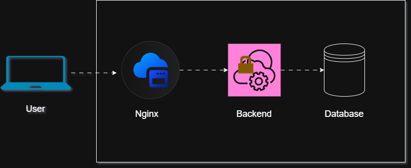

# Kubernetes Production App

## Project Goal
Deploy a production-style 3-tier application on Kubernetes with scaling, observability, and security features.

## Tech Stack
- Kubernetes
- Helm
- Docker
- Prometheus & Grafana
- Nginx (Frontend)
- PostgreSQL/MySQL (Database)

## Architecture Diagram
Include diagrams in `docs/architecture.png` and reference them here:


## Setup Instructions
1. Clone the repo:
```bash
git clone https://github.com/Emmanuel-DevOps-Portfolio/k8s-production-app.git
```
2. Apply manifests or Helm chart:
```bash
kubectl apply -f manifests/
# OR
helm install myapp charts/myapp
```
3. Verify pods and services:
```bash
kubectl get pods -n <namespace>
kubectl get svc -n <namespace>
```
What I Learned
- Designed workload isolation using Namespaces
- Configured RBAC for principle-of-least-privilege access control
- Implemented NetworkPolicies to restrict pod-to-pod communication
- Implemented Horizontal Pod Autoscaler (HPA) for dynamic scaling
- Debugged CrashLoopBackOff, readiness and liveness probe failures
- Implemented service-to-pod communication using label selectors
- Validated internal cluster networking and DNS-based service discovery

## Screenshots / Proof

Screenshots are available in the `/docs` directory:

- Grafana dashboards
- `kubectl get pods` output validation
- Helm release status verification


